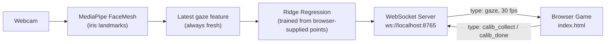

<div align="center">

# 👁️ Gaze Memory

**A memory-matching card game you play entirely with your eyes.**

No mouse. No keyboard. Just a webcam, your gaze, and a wink.


</div>

---

A Python backend tracks your eyes through your webcam and streams a live cursor into the browser. Walk through a quick on-screen calibration, then play: stare at a card to hover it, hold a wink for half a second to flip it. Find all 8 matching pairs to win.

## Table of Contents

- [Features](#features)
- [How It Works](#how-it-works)
- [Quick Start](#quick-start)
- [Calibration](#calibration)
- [Controls](#controls)
- [Project Structure](#project-structure)
- [Advanced Configuration](#advanced-configuration)
- [Tuning](#tuning)
- [FAQ](#faq)

## Features

- 🎯 **Hands-free gameplay** — dwell-to-hover, wink-to-click. Nothing else required.
- 🖌️ **Calibration, right there in the browser** — no separate native window to fumble with. Nine glowing dots walk you through setup, with live progress dots and a per-dot sample bar.
- 🥶 **Snap-freeze clicking** — the cursor locks the instant a wink begins, so looking away mid-blink never misfires a click.
- 🖥️ **Edge-to-edge play area** — the board fills the entire screen, the same space calibration was just trained against — no separate coordinate system to drift out of sync.
- 🔊 **Built-in sound design** — every flip, match, mismatch, calibration sample, and win sound is synthesized live in the browser; no audio files to manage.
- ✨ **Polished feedback** — flip animations, sparkle bursts on a match, a shake on a miss, and a confetti finish.
- 🔌 **Self-healing connection** — if the backend restarts, the browser reconnects on its own.
- ⚙️ **Configurable backend** — point the WebSocket server at a different host/port with a couple of CLI flags.
- 🖱️ **Dev-friendly fallback** — every card also responds to a normal click or Enter/Space, so you can poke at the UI without the tracker running.

## How It Works



`tracker.py` reads your webcam and runs [MediaPipe](https://github.com/google/mediapipe) FaceMesh every frame to compute a small feature vector describing where your iris sits relative to your eye corners — this is kept "fresh" continuously, whether or not calibration is running.

`index.html` owns the calibration sequence entirely: it shows you a dot, you press Spacebar, and it sends that dot's exact on-screen coordinates to Python along with a request to "collect a sample." Python pairs whatever gaze feature was freshest at that instant with those coordinates. After 9 dots' worth of samples, the browser asks Python to fit a Ridge regression model (with polynomial features) directly against those points — so the model is trained in **exactly** the coordinate space it's later used in, with nothing to reconcile between a debug window and the browser.

Once trained, Python streams predicted gaze position to the browser ~30 times a second, and a tiny console window shows live face/model/EAR diagnostics — it's a status readout now, not a second display to keep in sync.

## Quick Start

```bash
git clone https://github.com/yourname/gaze-memory.git
cd gaze-memory
pip install -r requirements.txt
python tracker.py
```

Then open **`index.html`** in your browser (just double-click it). It connects to the backend automatically, and you'll land straight on the calibration screen.

> **Webcam required.** No GPU needed; everything here runs comfortably on CPU.

## Calibration

Calibration happens entirely on the calibration screen in your browser — no native window, no keyboard shortcuts to memorize beyond one key.

1. Click **Start Calibration**.
2. A teal dot appears. Look directly at it.
3. Press **Spacebar** — repeat **5 times** while holding your gaze on the dot (the bar underneath fills as samples come in).
4. The dot jumps to the next position automatically. Repeat for all **9 dots**.
5. Once the last dot is done, you'll see "Training model…" for a moment, and the game starts immediately — no extra click needed.

If a Spacebar press doesn't register a sample (shown as a warning under the button — usually "No face detected"), just check your lighting and press it again; it doesn't advance until 5 valid samples land.

Calibration only needs to happen once per run — just don't move the webcam or change your lighting drastically afterward, and try not to resize the browser window mid-session, since the model is trained against that window's exact dimensions.

## Controls

| Action | How |
|---|---|
| Move the cursor | Look around the screen |
| Hover a card | Hold your gaze on it for ~0.6s |
| Flip a card | Wink your **right eye** and hold for ~0.5s |
| Collect a calibration sample | Press **Spacebar** while looking at the dot |
| *(testing without a webcam)* | Click a card, or focus it and press Enter/Space |

## Project Structure

```
.
├── tracker.py          # Backend — webcam capture, gaze tracking, calibration, WebSocket server
├── index.html          # Frontend — calibration UI, game board, gaze cursor, sound & animation
├── requirements.txt    # Python dependencies
```

## Advanced Configuration

By default the backend serves the WebSocket on `ws://localhost:8765`. You can point it elsewhere with CLI flags:

```bash
python tracker.py --host 0.0.0.0 --port 9000
```

| Flag | Default | Description |
|---|---|---|
| `--host` | `localhost` | Interface the WebSocket server binds to |
| `--port` | `8765` | Port the WebSocket server listens on |

> **Heads up:** `index.html` connects to a hardcoded `ws://localhost:8765` (the `WS_URL` constant near the top of its `<script>`). If you change `--host`/`--port`, update that constant to match before opening the page.

## Tuning

Most tracking behavior lives in `tracker.py`, near the top of the file:

| Constant | File | Default | Effect |
|---|---|---|---|
| `BUFFER_SIZE` | `tracker.py` | `8` | Frames averaged to smooth the predicted gaze point |
| `DEADZONE_RADIUS` | `tracker.py` | `35` | Minimum pixel movement before the cursor reacts — filters out jitter |
| `SMOOTHING` | `tracker.py` | `0.12` | How quickly the cursor eases toward its target. Lower = smoother but slower |
| `WINK_TIME_THRESHOLD` | `tracker.py` | `0.5` | Seconds a wink must be held before it counts as a click |
| `EAR_FREEZE_THRESH` / `EAR_CLOSE_THRESH` / `EAR_OPEN_THRESH` | `tracker.py` | `0.22` / `0.15` / `0.20` | Eye-aspect-ratio thresholds distinguishing "freezing," "fully winked," and "open" |
| `SAMPLES_PER_DOT` | `index.html` | `5` | Spacebar presses required per calibration dot |

## FAQ

**Calibration keeps warning "No face detected."**
MediaPipe's iris detection needs decent, even light on your face — avoid strong backlighting, and make sure your whole face is in frame before pressing Spacebar.

**The cursor isn't moving at all after calibration.**
Make sure the console printed `Calibration complete! Switch to your browser tab` equivalent — check that `index.html`'s console shows `Connected` in the top-right HUD, and that you didn't resize the browser window after calibrating (the model is trained against that exact window size).

**Clicks fire too easily, or not easily enough.**
Adjust `EAR_CLOSE_THRESH` and `WINK_TIME_THRESHOLD` in `tracker.py` (see [Tuning](#tuning)).

**The page says "Disconnected" and won't go away.**
Make sure `tracker.py` is running — the page retries the connection every 2 seconds, so it'll pick up automatically once the backend is up. If you customized `--host`/`--port`, double check `WS_URL` in `index.html` matches.

**I want to recalibrate without restarting the script.**
There's currently no "recalibrate" button exposed once the game starts — restart `tracker.py` for a clean calibration if your lighting or position changes significantly.
